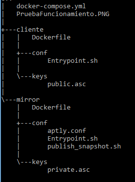

#### Informe proyecto final
#### Sistemas Distribuidos
#### Cristian González - Juan José Pizarro - Jaime Vélez
#### Universidad Icesi

#### Objetivos

- Emplear herramientas de aprovisionamiento automático para la realización de tareas en
    infraestructura.
- Instalar y configurar espejos de sistemas operativos en forma automática para el
    soporte al aprovisionamiento de máquinas virtuales en clústers de cómputo.
- Especificar y desplegar ambientes conformados por contenedores virtuales para la
    realización de tareas específicas.

#### Introducción

En ambientes conformados por cantidades considerables de nodos como es el caso de clústers
de cómputo, se requiere contar con mecanismos eficientes para la actualización y despliegue
de nueva infraestructura.
Para este proyecto deberá realizar el aprovisionamiento automático de un espejo por medio de
las herramientas vistas en clase. Debe cumplir con los siguientes requerimientos:
- El espejo debe ser del sistema operativo ubuntu-xenial.
- Debe especificar por medio de un arreglo los paquetes a instalar.
- No es necesario que genere llaves nuevas cada vez que despliegue el espejo, puede crearlas previamente y precargarlas en la solución de aprovisionamiento automático a emplear.
- Probar por medio del despliegue de uno o varios contenedores que el mirror ha sido correctamente desplegado.

#### Descripción de la arquitectura

#### Implementación
La implementación se realizó en dos módulos uno para el mirror y otro para los clientes. Cada
uno de los cuales se implementó mediante contenedores virtuales, para lograr automatizar la
configuración del servicio y el acceso al mismo.

- Mirror
El mirror se aprovisionó mediante Docker en un contenedor virtual, este se configura haciendo
uso de Aptly, todos los comandos necesarios para el aprovisionamiento de este servicio se
automatizaron en un archivo DockerFile, se tomó como referencia la guía de configuración de
Aptly, disponible en línea en: https://www.aptly.info/tutorial/mirror/.
Los aspectos a considerar en la automatización de esta configuración son: en primera medida
se requiere generar una llave privada y pública para la autenticación entre el mirror y los
clientes. Se deben crear archivos con los comandos de inicio para la imagen (Entrypoint.sh)
como también un archivo con la configuración propia para Aptly (aptly.conf). Otro archivo de
configuración automatizado es el publish_snapshot.sh que contiene la configuración necesaria
para la publicación del snapshot del mirror. A continuación se presenta la estructura de
carpetas de la solución.

- Cliente
Del lado de los clientes, mediante un Dockerfile se automatiza la configuración del mismo, se
sigue la misma lógica del mirror, pero con la configuración específica del cliente. A este se le
debe agregar la llave pública mediante gpp, para la autenticación con el mirror, se define también un Entrypoint.sh el cual modifica el sources.list y realiza una actualización, la cual debe
tener como servidor el mirror creado.

#### Pruebas de funcionamiento
A continuación tenemos la salida de consola, en la que se observa el correcto despliegue del
mirror.
En esta imagen, tenemos el cliente, actualizandose desde el mirror creado (mirror_1).
